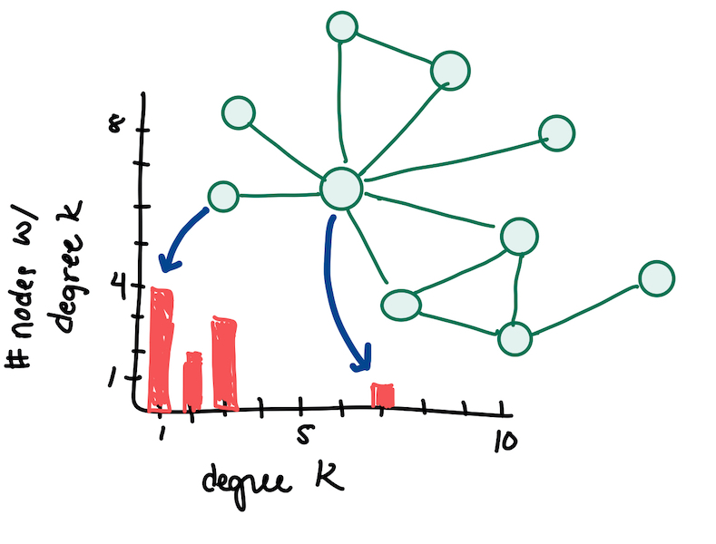
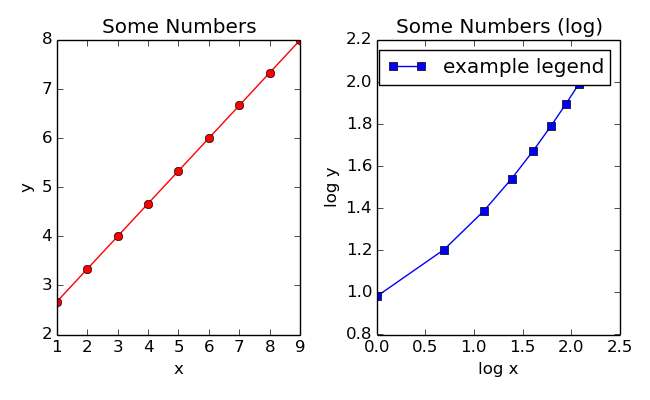
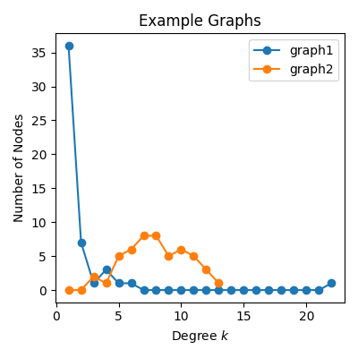

# Programming Assignment 1: Degree Distribution


In this homework, you will plot the degree distribution of animal social networks. All graphs are undirected and unweighted, and they are located in the `files/` subdirectory.

* **Assignment Out:** Wednesday, Sept 1
* **Assignment Due:** Monday, Sept 13

## The Goal

Your goal is to plot a histogram of the degrees for each network.  The x-axis plots the degree _k_ (the number of neighbors).  The y-axis plots the number of nodes that have degree _k_.  The example below plots the histogram of a 10-node graph.



We will calculate other statistics on other networks; much of the code you write in this assignment will be extended later.

## :star: **Task A**: `Matplotlib` Preliminaries

`Matplotlib` is a plotting and visualization library for Python.  The `plot_graph.py` file contains a single function, which plots some numbers.  To see if you have `matplotlib` installed on your machine, try running `plot_graph.py`.  If it runs without errors, you're ready to go to the next task!  If you get errors, it may be because `matplotlib` is not yet installed on your machine.

If you are using Anaconda, you can search for and open the Anaconda Command Prompt and type the following. If you are not using Anaconda and you're on a Mac, you can open a Terminal and type the following:
```
pip install matplotlib
```

- If you get a permissions error, use `sudo`, which provides admin access so the package can be installed in the Python directory:
```
sudo pip install matplotlib
```

- If you get an error that `pip` is not found and you are using Anaconda, try using `pip` within a `conda` environment: [here is some documentation](https://docs.conda.io/projects/conda/en/latest/user-guide/tasks/manage-environments.html#using-pip-in-an-environment).

- If you get an error that `pip` is not found and you are not using Anaconda, then try installing `pip` according to [these instructions](https://pip.pypa.io/en/stable/installing/).

- If none of these work, ask Anna.

When you run `plot_graph.py`, a new file, `numbers.png` is created in the same directory in which you are running the code.  Opening this file shows a two-panel figure with one red curve and one blue curve:



There is also a `numbers_bar.png` that illustrates a bar chart.  Find the place in `plot_graph.py` where you can modify the colors, line styles, and markers.  A subset of the [colors](https://matplotlib.org/3.1.0/gallery/color/named_colors.html), [marker styles](https://matplotlib.org/3.3.1/api/markers_api.html), [line styles](https://matplotlib.org/3.2.1/gallery/lines_bars_and_markers/linestyles.html), for the `plot()` function are below.  They are passed as a single string, e.g., `'ro-'` is a red line with circle markers.  Order does not matter.

| Colors | Line Styles | Line Markers |
| -- | -- | -- |
| `r` red | `-` solid | `o` circle|
| `g` green | `--` dashed | `.` point |
| `b` blue | `-.` dash-dot | `s` square |
| `y` yellow | `:` dotted | `+` plus |
| `m` magenta | | `x` x marker |
| `c` cyan |  | `d` diamond |
| `k` black |  | `*` star|

:question: Modify the line styles in the two subpanels and observe what happens when you rerun `plot_graph.py`.  

## :star: **Task B**: Read a Graph from a File

You will write your code in the `hw1.py` file, copying functions from `plot_graph.py` as necessary.  If you are familiar with `matplotlib` you are also welcome to write your own custom plotting functions (though avoid the `hist()` function for this assignment).  

For this task, use `files/graph1.txt` and `files/graph2.txt`, which have notably different degree distributions. The nodes are numbered (0,1,2,...), and each row contains an edge separated by a tab (`\t`):

``nodeA nodeB``

Open these files to see how they are structured.

Write a `read_edge_file()` function that takes a filename (as a string) and returns a data structure representing the graph.

:question: Which data structure is best here?  We have learned about adjacency matrices, adjacency lists, and edge lists.  You decide which data structure to use.

:bulb: Hint: to read information from a file, see the [Bio131 Python Crashcourse](https://annaritz.github.io/python-crashcourse/) and [Python Standard Library](https://docs.python.org/3/tutorial/inputoutput.html#reading-and-writing-files) descriptions.

:bulb: To split a string into a list, see the string manipulations in the [Bio131 Python Crashcourse](https://annaritz.github.io/python-crashcourse/). You will want to use a combination of `strip()` (which removes whitespace) and `split()` (which splits a string on a delimiter).

:bulb: If you want to use an adjacency list, see the [Bio131 Python Crashcourse](https://annaritz.github.io/python-crashcourse/) or [the standard library](https://docs.python.org/3/library/stdtypes.html#mapping-types-dict) for more guidance on dictionaries.

## :star: **Task C**: Calculate Degree Distribution of Example Graphs

Next, calculate the degree distribution of a graph represented by the data structure you choose. This is a **histogram** of node degrees for each network, where the x-axis contains the degree `k` and the y-axis contains the number of nodes that have degree `k`.  Write `get_degree()` function that takes the graph data structure and returns two lists: an `x` and a `y` that could be passed to `plt.plot()` later.  For the example graph at the top of this file, the lists would be:

```
x = [1,2,3,4,5,6,7,8,9,10] # degree k
y = [4,2,3,0,0,0,1,0,0,0]  # num of nodes w/ degree k
```

:bulb: Hint: if you want a refresher about how a function can return two variables (here, `x` and `y`), see this [pythontutor example](http://pythontutor.com/visualize.html#code=%23%23%20example%20of%20a%20function%20returning%20two%20variables%0A%0Adef%20f%28%29%3A%0A%20%20%20%20a%20%3D%201%0A%20%20%20%20b%20%3D%20'hi'%0A%20%20%20%20return%20a,b%0A%20%20%20%20%0Aret_a,ret_b%20%3D%20f%28%29%0Aprint%28'Values%20returned%20are',ret_a,'and',ret_b%29%0A%0Aret%20%3D%20f%28%29%0Aprint%28'If%20only%20one%20variable%20is%20specified,%5Cna%20tuple%20is%20returned%3A',ret%29%0A%0Aprint%28'Done.'%29&cumulative=false&curInstr=0&heapPrimitives=nevernest&mode=display&origin=opt-frontend.js&py=3&rawInputLstJSON=%5B%5D&textReferences=false).

## :star: **Task D**: Plot the Degree Distributions of the Example Graphs

You will call `get_degree()` twice: once for the graph from `files/graph1.txt` and then for the graph from `files/graph2.txt`.  Here, we want to plot _both_ degree distributions in one figure.  Write a `plot_deg_dist()` function that takes the `x` and `y` lists, legend/title labels (strings, e.g. `'graph1'`, and `'graph2'`), and a filename with a `.png` suffix and generates a figure with both histograms plotted on the same panel.

A minimum working example of figure plotting is shown below:
```
import matplotlib.pyplot as plt # put this at the top of your file
fig = plt.figure(figsize=(4,4))  # make a 4"x4" figure.
plt.plot([1,2,3,4,5],[1,1,1,1,1],'-ok',label='line')  # black line with circles
plt.xlabel('x')
plt.ylabel('y')
plt.title('Title')
plt.legend()
plt.tight_layout()  # make the labels  "snap" to the grid.
plt.savefig('example.png')   # save figure as PNG
```

:bulb: You can plot multiple lines on the same figure by calling `plt.plot()` multiple times:
```
plt.plot([1,2,3,4,5],[1,1,1,1,1],'o-')
plt.plot([1,1,1,1,1],[1,2,3,4,5],'s-')
```

Note that if you do _not_ specify a color, each line will be plotted in a different default color.

:bulb: You can also use the `plt.bar()` to plot bar graphs instead; see the `plot_graph.py` example code and this [blog post](https://benalexkeen.com/bar-charts-in-matplotlib/) or [this example code](https://matplotlib.org/stable/gallery/lines_bars_and_markers/barchart.html#sphx-glr-gallery-lines-bars-and-markers-barchart-py) from the gallery.

:question: Sanity Check: The degree distributions from `graph1.txt` and `graph2.txt` look like the following.



:question: Will your code work if you want to plot more than two lines on the figure?  Consider rewriting your function to take a list of `[x,y]` lists and a list of legend labels.

## :star: **Task E**: Plot the Degree Distributions of Animal Social Networks

Now, you are ready to plot the degree distributions of animal social networks.  The `files/` directory contains four real social networks (compiled from the [Index of Complex Networks](https://icon.colorado.edu/)):

**dolphin.txt**: An undirected social network of frequent associations observed among 62 dolphins (Tursiops) in a community living off Doubtful Sound, New Zealand, from 1994-2001. _D. Lusseau et al., [The bottlenose dolphin community of Doubtful Sound features a large proportion of long-lasting associations.](http://citeseerx.ist.psu.edu/viewdoc/download?doi=10.1.1.174.3721&rep=rep1&type=pdf) Behavioral Ecology and Sociobiology 54(4), 396-405 (2003)._

**badger.txt** Social interactions among a badger population in the United Kingdom to study the spread of Tuberculosis (Tb), since badgers are known Tb reservoirs that can infect cattle. _Weber, Nicola, et al. [Badger social networks correlate with tuberculosis infection.](https://www.sciencedirect.com/science/article/pii/S0960982213011238) Current Biology 23.20 (2013)_ (data obtained from the authors).

**zebra.txt**: Social interactions among a group of wild Grevy's zebras (Equus grevyi), observed in Mpala Ranch in Kenya in 2002. _S. R. Sundaresan et al., [Network metrics reveal differences in social organization between two fission-fusion species, Grevy's zebra and onager.](https://www.princeton.edu/~equids/images/gz_ong_static.pdf) Oecologia 151(1), 140-149 (2007)_

**dog.txt**: Social network among free-ranging domesticated dogs (Canis familiaris) in two settlements in rural Chad, collected in 2018 using proximity sensors. _J. K. Wilson-Aggarwal et al., [High-resolution contact networks of free-ranging domestic dogs Canis familiaris and implications for transmission of infection.](https://journals.plos.org/plosntds/article?id=10.1371/journal.pntd.0007565) PLOS Neglected Tropical Diseases (2019)_

Write code to plot the degree distributions of these four animal social networks.  Retain the code to plot the example graph degree distributions.  You can put this in a new function or within the `main()` function. The figure should include a title, x- and y-labels, and a legend.

## :star: **Task F**: Comment on the Differences in Degree Distributions

In `hw1.py` as comments (preceded by a `#`), write a few sentences comparing these four different animal social networks. Briefly talk about trends, interesting features, or comparisons between different networks.  Aim for a short paragraph.

Note that you might want to generate other types of figures (multi-panel, bar charts, etc.) to better see these trends.

## Submitting

:star2: **You're Done with Tasks A-F!** Submit `hw1.py` and one figure of the animal social network degree distributions via Moodle. Before you submit `hw1.py`, look through the comments and add any additional ones that explain what your code does.  I will provide feedback on your code organization and comments.

### Instructions for Resubmitting

As described on the [syllabus](https://moodle.reed.edu/pluginfile.php/232708/mod_resource/content/1/syllabus.pdf), there is no penalty for resubmitting this assignment as long as you follow the instructions below. All resubmissions are due by Finals Week - ask Anna if you have any questions.

* Submit whatever you have by the deadline.
* Add a comment to the top of your code indicating that you plan to resubmit this assignment (e.g. "I plan to resubmit this assignment.")
* Schedule a meeting with Anna within one week of the deadline to make a plan.
