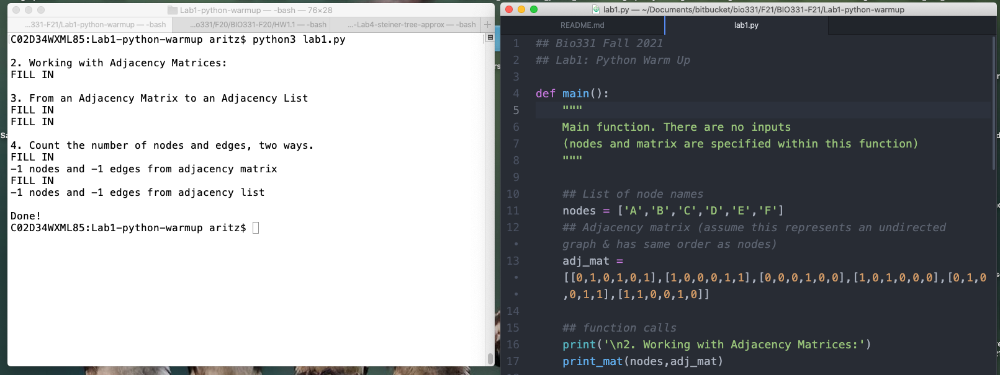
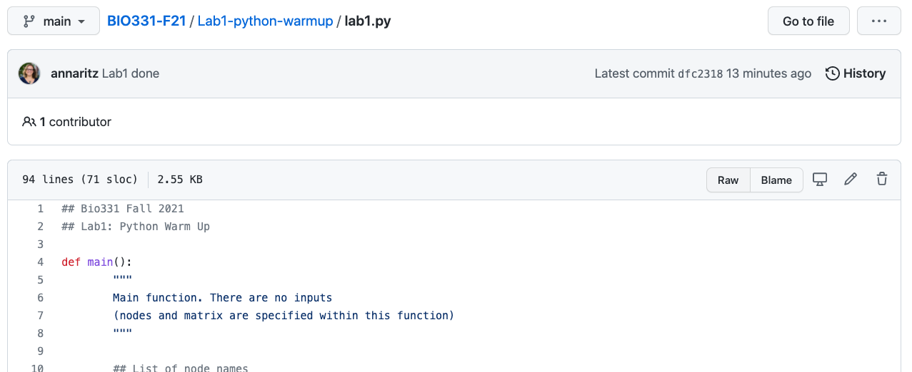
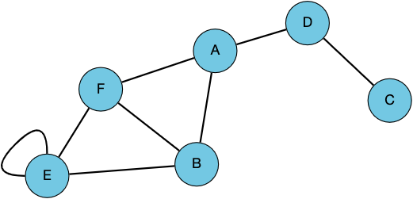

# Lab 1: Python Warmup

This Python warmup lab will review installation and GitHub instructions, provide practice working with lists and dictionaries, and introduce two ways to store graphs.  There are five tasks in this module (Tasks A-E).  Items labeled with :question: are sanity checks; you do not need to answer them in the code, but make sure you understand them.

**Resources:** Refer to the [the Python Resources on Moodle](https://moodle.reed.edu/mod/page/view.php?id=186831) page or the [Bio131 Python Crashcourse](https://annaritz.github.io/python-crashcourse/) for Python syntax refreshers.  [PythonTutor]() can also help you with interactive debugging.

## 0. Preliminaries

These will each take a couple minutes.

1. Fill out the [Student Hour availability poll](https://forms.gle/Vc2PK4unfTfE6zVV6).
2. Register for the Machine Learning in Computational Biology ([MLCB](https://sites.google.com/cs.washington.edu/mlcb2021/)) conference. [Registration Link](https://docs.google.com/forms/d/e/1FAIpQLSff3u2lhVP5L0DLWQyJe3BNTZg1RrI_rwSKYkehlJW5OOGhPg/viewform?usp=sf_link)
3. Join the [Bio331-F21 Slack Workspace](https://join.slack.com/t/slack-bws9345/shared_invite/zt-uuqtz2cn-sB4r614qbwWw5QA3EGgnLQ). We may use Slack for informal communication and group work.


## 1. Installing Python3 and Working with `lab1.py`

Decide how you want to complete programming assignments in this class. For this class, you should install Python3 and an editor of your choice on your laptop or use the ETC/CompBio machines. Some editors will have a terminal-style input built-in; others will require a Terminal. Follow the instructions posted on [Moodle](https://moodle.reed.edu/mod/page/view.php?id=186831) page.  You can also use the Anaconda and Spyder installation instructions that is used for Math121. I use Atom and a Terminal on my Mac:



:question: Determine what version of Python you are using by typing the following in your terminal (or Spyder's terminal-like window).  
```
python --version
```
You should have Python version 3 (the most recent version of Python is 3.9.6, but older versions should be fine).

**Download Lab Materials.** This lab requires you to download and modify `lab1.py`.  In a few weeks, we will learn about [Git](https://git-scm.com/) and [GitHub](https://github.com/); if you know these tools you are free to fork this repo.  For now, though, you will follow these instructions to download and modify `lab1.py` and, once you are satisfied with the assignment, you will submit the `lab1.py` file via Moodle.  You have two options:
- On Moodle, you can download the `lab1.py` file.
- On GitHub, you can click `lab1.py` and click the "Raw" button (or you can go [straight to this link](https://raw.githubusercontent.com/Reed-CompBio/BIO331-F21/main/Lab1-python-warmup/lab1.py)).



This is clunky, but will get better when we learn about version control.

Once you have installed Python3 and have your editor of choice, you should be able to download `lab1.py` and run it without errors.  When you run `lab1.py`, you will get some "FILL IN" stubs and all counts are -1.  You will change these parts in the file.

:bulb: Hint: beware of tabs vs. spaces in Python; different editors have different default values. If you keep getting `IndentationError`, `SyntaxError`, or `Inconsistent use of tabs and spaces` when changing simple things replace all spaces to tabs (or vice versa).

## 2. Working with Adjacency Matrices

Suppose we want to describe the following graph, which has six nodes (`A`-`F`) and eight undirected edges.



This graph can be represented as an [adjacency matrix](https://mathworld.wolfram.com/AdjacencyMatrix.html), where entry _(i,j)_ in the matrix is 1 if the _i_ th node is connected to the _j_ th node and 0 otherwise.

```
  A B C D E F
A 0 1 0 1 0 1
B 1 0 0 0 1 1
C 0 0 0 1 0 0
D 1 0 1 0 0 0
E 0 1 0 0 1 1
F 1 1 0 0 1 0
```

The file `lab1.py` includes a skeleton of the code you will write for this lab.  Line 12 assigns a list of strings to the `nodes` variable - these are the node names.  Line 14 assigns a list of lists to the `adj_mat` variable.  Note that the adjacency matrix is ordered according to the `nodes` variable.

:star: **Task A**: write a `print_mat()` function to print the adjacency matrix _exactly_ as shown above (including spacing).  This function takes two arguments, `nodes` and `adj_mat`, and returns nothing

:bulb: Hint: elements of `nodes` are strings; elements of `adj_mat` are lists of integers. You can cast an integer `x` to a string using `str(x)`.

:bulb: Hint: first get the contents of the lines to print correctly, _then_ worry about the spacing and alignment.

:question: What's the difference between `print()` and `return`? See this [pythontutor example](http://pythontutor.com/visualize.html#code=%23%20example%20from%20https%3A//www.reddit.com/r/learnpython/comments/8k7h3z/print_vs_return/%0A%0A%23%20define%20two%20functions%3A%20one%20prints%205%20and%20one%20returns%205.%0Adef%20print_5%28%29%3A%0A%20%20%20%20print%285%29%0A%20%20%20%20%0Adef%20return_5%28%29%3A%0A%20%20%20%20return%205%0A%0Ar1%20%3D%20print_5%28%29%0Aprint%28'print_5%28%29%20returns',r1%29%0A%0Ar2%20%3D%20return_5%28%29%0Aprint%28'return_5%28%29%20returns',r2%29%0A%0Aprint%28'%22print%28%29%22%20is%20a%20function,%20but%20%22return%22%20returns%20the%20value.'%29&cumulative=false&curInstr=0&heapPrimitives=nevernest&mode=display&origin=opt-frontend.js&py=3&rawInputLstJSON=%5B%5D&textReferences=false).

## 3. From an Adjacency Matrix to an Adjacency List

We can also store the graph according to the neighbors of each node.  This data structure is called an [adjacency list](https://en.wikipedia.org/wiki/Adjacency_list), and can be implemented using [Python dictionaries](https://docs.python.org/3/library/stdtypes.html#mapping-types-dict). The adjacency list will contain the following information:

```
Node : Neighbors
A: B D F
B: A E F
C: D
D: A C
E: B F E
F: A B E
```

:star: **Task B**: Write a function `mat_to_list()` that converts an adjacency matrix to an adjacency list. The adjacency list is a dictionary of `key`,`value` pairs, where the keys are nodes and the values are a list of neighbors. (You can use [Python sets](https://docs.python.org/3/tutorial/datastructures.html#sets) instead of lists for the values, but this is optional).  The `mat_to_list()` function takes two inputs, `nodes` (list of strings) and `adj_mat` (list of lists), and returns an `adj_list` dictionary.

:bulb: Hint: you can iterate through a list of lists by using a nested `for` loop.

:bulb: Want more guidance about dictionaries?  See the [Bio131 Python Crashcourse](https://annaritz.github.io/python-crashcourse/) or [the standard library](https://docs.python.org/3/library/stdtypes.html#mapping-types-dict).

:star: **Task C**: Write a `print_list()` function to print the adjacency list as shown above (the order of nodes and neighbors may be different). This function takes one input, `adj_list`, and returns nothing.

:bulb: Hint: you can iterate over all the keys in dictionary `D` by writing `for key in D` or `for key in D.keys()`.

## 4. Count the number of nodes and edges, two ways.

We can now use the `adj_mat` variable and the `adj_list` variable (returned by your `mat_to_list()` function) to count the number of nodes and edges in two ways.  Both `count_from-adj_mat()` and `count_from_adj_list()` should return the same values.  

:star: **Task D**: Write a `count_from_adj_mat()` function that takes one input, `adj_mat`, and returns the number of nodes and edges in the graph.

:star: **Task E**: Write a `count_from_adj_list()` function that takes one input, `adj_list`, and returns the number of nodes and edges in the graph.

:bulb: Hint: You can cast an float `x` to an int using `int(x)`.

## Bonus: Build an Edge List

We have now seen adjacency matrices and adjacency lists; a third way to represent graphs is by using an [edge list](https://en.wikipedia.org/wiki/Edge_list), which is simply a list of lists (or list of tuples) that captures the edges:

```
[['A','B'],['A','D'],['A','F'],...]
```
:star: **Bonus Task**: Write a function `to_edgelist()` that builds an edge list for this graph. You can use either the adjacency matrix or the adjacency list as input.

:question: If `['A','B']` is an edge in the edge list, should `['B','A']` also be in the edge list?  It's up to you.

## Submitting

:star2: **You're Done with Tasks A-E!** Submit `lab1.py` via Moodle.  You do not need to finish the entire lab as long as you grasp the main points.  Remember that labs are marked as complete/incomplete, and if you work consistently in lab it will be marked as complete.
